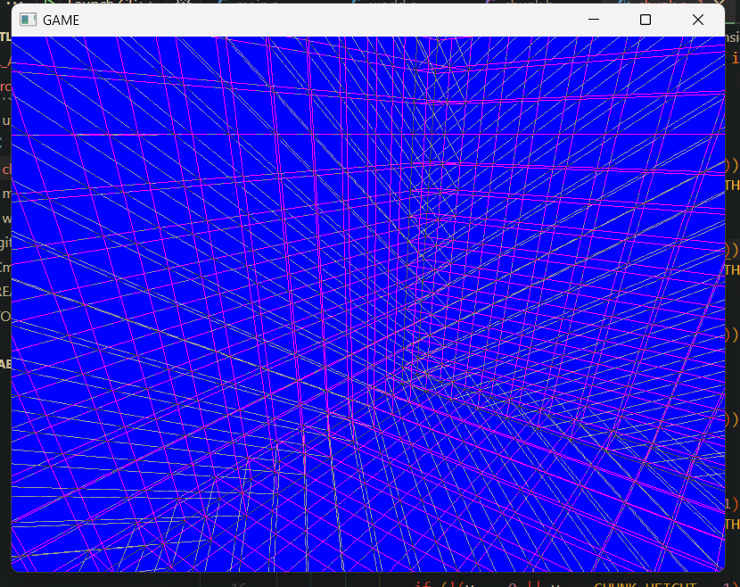
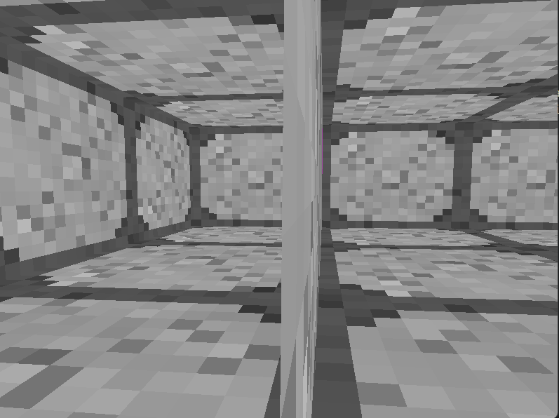
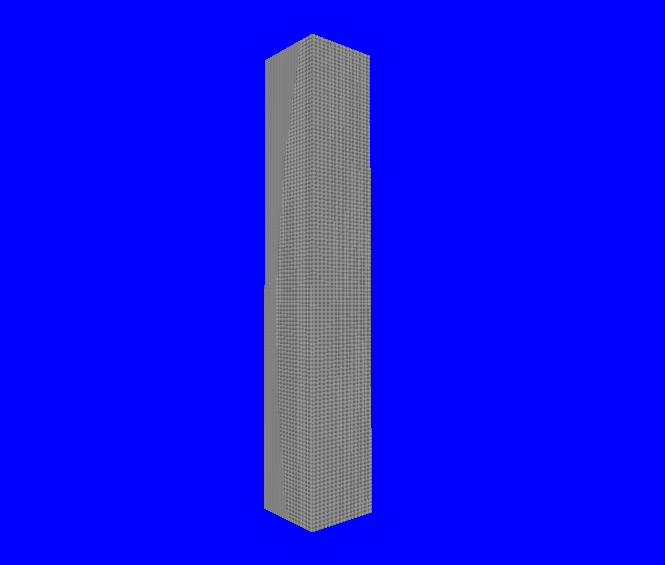
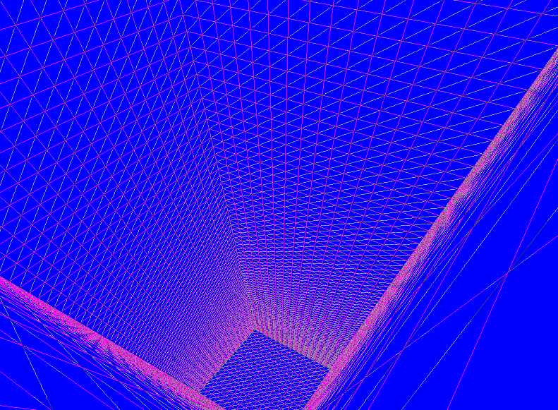

# Roadmap

## chunk mesh redo
[Chunk](src/chunk.c)
### old structure
right now we use a very inefficient chunk mesh data structure.
- it is messy
- it's slow tough optimized for low memory
- no greedy meshing is done
- to generate the chunk a long processing time is being taken and becomes way more complex more face exist.
```c
enum Side
{
    FRONT,
    BACK,
    RIGHT,
    LEFT,
    TOP,
    BOTTOM
};
struct Face
{
    enum Side side;
    int visible;
    unsigned char textureID;
};
struct BlockMesh
{
    struct Face front;
    struct Face back;
    struct Face right;
    struct Face left;
    struct Face top;
    struct Face bottom;
};
struct Chunk
{
    unsigned int vao;
    unsigned int vbo;
    unsigned int block_count;
    unsigned int numof_faces;
    unsigned char blocks[CHUNK_VOLUME];
    struct BlockMesh block_meshes[CHUNK_VOLUME];
    float *mesh;
}
```
### new structure
as you might have notice this structure is unnecesserly complex with too many useless data floating around, we can clean up alot by abstracting away the mesh structure.
```c
struct Mesh{
    float *vert;
    uint vert_size;
}
```
as you can see a mesh is just a set of vertices and nothing more, we have abstracted away the idea of faces and blocks since its assumed that each face has a set amounts of vertices tough the same cant be said about blocks a mesh really shouldnt be aware of blocks as faces are the only unites they should care about.

### removing out of view faces from the mesh
but that rises and other problem, how do we remove faces? we can do that process before consructing the mesh.
```c
struct Mesh
{
    float *vert;
    unsigned int vert_size;
};
// each chunk mesh lives on the heap
// until unloaded then we call this function again to load it
// or during chunk updates (placing removing blocks)
void createChunkMesh(unsigned char *blocks, unsigned int size)
{
    struct Mesh *mesh = (struct Mesh *)malloc(sizeof(struct Mesh) * size);
    // over allocate memory until we reallocate at the end
    // this is probably unsafe (and inefficient)
    float *vert = (float *)malloc(sizeof(float) * 5 * size * 6);
    unsigned int verts_added;
    for (int i = 0; i < size; i++)
    {
        if (!blocks[i])
            continue;
        int j = 0;
        j = i - CHUNK_WIDTH; // z - 1
        if (j > 0)
            if (!blocks[j])
            {
                for (unsigned int ii = 0; ii < 30; ii++)
                {
                    vert[verts_added + ii] = front_buffer[ii];
                }
                verts_added += 30;
            }
        j = i + CHUNK_WIDTH; // z + 1
        if (j < size)
            if (!blocks[j])
            {
                for (unsigned int ii = 0; ii < 30; ii++)
                {
                    vert[verts_added + ii] = back_buffer[ii];
                }
                verts_added += 30;
            }
        j = i - CHUNK_WIDTH * CHUNK_WIDTH; // y - 1
        if (j > 0)
            if (!blocks[j])
            {
                for (unsigned int ii = 0; ii < 30; ii++)
                {
                    vert[verts_added + ii] = bottom_buffer[ii];
                }
                verts_added += 30;
            }
        j = i + CHUNK_WIDTH * CHUNK_WIDTH; // y + 1
        if (j < size)
            if (!blocks[j])
            {
                for (unsigned int ii = 0; ii < 30; ii++)
                {
                    vert[verts_added + ii] = top_buffer[ii];
                }
                verts_added += 30;
            }
        j = i - 1; // x - 1
        if (j > 0)
            if (!blocks[j])
            {
                for (unsigned int ii = 0; ii < 30; ii++)
                {
                    vert[verts_added + ii] = left_buffer[ii];
                }
                verts_added += 30;
            }
        j = i + 1; // x + 1
        if (j < size)
            if (!blocks[j])
            {
                for (unsigned int ii = 0; ii < 30; ii++)
                {
                    vert[verts_added + ii] = right_buffer[ii];
                }
                verts_added += 30;
            }
    }
    // we have made our mesh but we over allocated memory
    float *vert_out = (float *)malloc(sizeof(float) * verts_added);
    memcpy(vert_out, vert, sizeof(float) * verts_added);
    free(vert);
    mesh->vert = vert_out;
    mesh->vert_size = verts_added;
}
```
we can use the pattern that appears in flat 3d arrays where we dont need loops to collect near blocks
```json
{
    "Left block":       idx - nz,
    "Right block":      idx + nz,
    "Bottom block":     idx - (nz*ny),
    "Top block":        idx + (nz*ny),
    "Front block":      idx - 1,
    "Back block":       idx + 1
}
```
### Memory Optimization of Chunk Mesh
the mesh itself can be compressed even further by eliminating paddings. (wasted bytes)

consieder a full chunk we have generated its mesh using our algorithm so it has barely any faces each have 6 vertices (we'll touch that later for now) and each vert has 5 floating values, these are needed for rendered to be in this format. not to mention we'll be implementing lighting in the future as well.

to store this mesh in memory it takes 4 bytes each so 20 bytes for a single vertex, which 6 of those (2 are the same ik doing indexing is more efficient but we keeping simple) make a 120 bytes for each face, imagine a full chunk with no optimization would take 16x16x128x120 bytes, that's 4 MBs for a single chunk, ofc our last optimization helped a lot and prob reduced it to orders of KBs still thats a long way to go, especialy since chunks arent always solid and have noise which makes their mesh size varied.
```c
struct Vertex{
    float x;
    float y;
    float z;
    float u;
    float v;
}
```
we can take an assumption that the x,y,z value arent floating points almost never are, and are infact not 4 bytes size much smaller infact, they barely excede 16 and only y exedes that and only up to 128, which only need 8 bits (1 byte) to store.
and for x and z, we have 3 bits for each (up to 16 exclusive) which makes them 6 bits, that will fit prefectly fine in an unsigned byte with 2 bits free (wasted for now).
```c
struct Vertex{
    unsigned char y;
    unsigned char x_z;
}
struct Vertex vert;
flaot x,y,z;
// if you have problems understanding this
// expression read it from left to right
// we say shift x to left and make 3 bits
// space for z and then we | it with y
// which makes z occupy only the freed space
// we allocated for it! neat stuff
//! note make sure x and z fit in 3 bits first
vert.x_z = x << 3 | z;
// retriving is just the reverse
// note 15 is just maximum 3 bit number (2^4 -1)
x = vert.x_z >> 3 & 15; 
z = vert.x_z & 15; 
y = vert.y;
```


```c

#pragma region NEW
struct Mesh
{
    float *vert;
    unsigned int size;
};
void createChunkMesh(unsigned char *blocks, unsigned int size, float **_dest_mesh, unsigned int *_dest_size)
{
    // struct Mesh *mesh = (struct Mesh *)malloc(sizeof(struct Mesh) * size);
    float *vert = (float *)malloc(sizeof(float) * 5 * size * 6 * 6);
    unsigned int verts_added = 0;
    for (int i = 0; i < CHUNK_VOLUME; i++)
    {
        if (blocks[i] == 0)
            continue;
        float x = i % CHUNK_WIDTH;
        float z = (i / CHUNK_WIDTH) % CHUNK_WIDTH;
        float y = (i / CHUNK_WIDTH / CHUNK_WIDTH) % CHUNK_HEIGHT;
        bool sides[6];
        for (size_t k = 0; k < 6; k++)
        {
            int j = 0;
            switch (k)
            {
            case FRONT:
                // j = i - CHUNK_WIDTH; // z - 1
                j = x + (z - 1) * CHUNK_WIDTH + (y)*CHUNK_HEIGHT * CHUNK_WIDTH;
                sides[k] = (blocks[j] != 0 && z - 1 > 0);
                break;
            case BACK:
                // j = i + CHUNK_WIDTH; // z + 1
                j = x + (z + 1) * CHUNK_WIDTH + (y)*CHUNK_HEIGHT * CHUNK_WIDTH;
                sides[k] = (blocks[j] != 0 && z + 1 < CHUNK_WIDTH);
                break;
            case RIGHT:
                j = i + 1; // x + 1
                // j = x + 1 + (z)*CHUNK_WIDTH + (y)*CHUNK_HEIGHT * CHUNK_WIDTH;
                sides[k] = (blocks[j] != 0 && x + 1 > 0);
                break;
            case LEFT:
                j = i - 1; // x - 1
                // j = x - 1 + (z)*CHUNK_WIDTH + (y)*CHUNK_HEIGHT * CHUNK_WIDTH;
                sides[k] = (blocks[j] != 0 && y + 1 < CHUNK_HEIGHT);
                break;
            case TOP:
                // j = i + CHUNK_WIDTH * CHUNK_WIDTH; // y + 1
                j = x + (z)*CHUNK_WIDTH + (y + 1) * CHUNK_HEIGHT * CHUNK_WIDTH;
                sides[k] = (blocks[j] != 0 && y + 1 > 0);
                break;
            case BOTTOM:
                // j = i - CHUNK_WIDTH * CHUNK_WIDTH; // y - 1
                j = x + (z)*CHUNK_WIDTH + (y - 1) * CHUNK_HEIGHT * CHUNK_WIDTH;
                sides[k] = (blocks[j] != 0 && y + 1 < CHUNK_WIDTH);
                break;
            }
        }
        if (sides[FRONT])
        {
            for (unsigned int ii = 0; ii < 30; ii++)
            {
                if (ii % 5 == 0)
                    vert[verts_added + ii] = front_buffer[ii] + x;
                else if (ii % 5 == 1)
                    vert[verts_added + ii] = front_buffer[ii] + y;
                else if (ii % 5 == 2)
                    vert[verts_added + ii] = front_buffer[ii] + z;
                else
                    vert[verts_added + ii] = front_buffer[ii];
            }
            verts_added += 30;
        }
        if (sides[BACK])
        {
            for (unsigned int ii = 0; ii < 30; ii++)
            {
                if (ii % 5 == 0)
                    vert[verts_added + ii] = back_buffer[ii] + x;
                else if (ii % 5 == 1)
                    vert[verts_added + ii] = back_buffer[ii] + y;
                else if (ii % 5 == 2)
                    vert[verts_added + ii] = back_buffer[ii] + z;
                else
                    vert[verts_added + ii] = back_buffer[ii];
            }
            verts_added += 30;
        }
        if (sides[BOTTOM])
        {
            for (unsigned int ii = 0; ii < 30; ii++)
            {
                // vert[verts_added + ii] = bottom_buffer[ii];
                if (ii % 5 == 0)
                    vert[verts_added + ii] = bottom_buffer[ii] + x;
                else if (ii % 5 == 1)
                    vert[verts_added + ii] = bottom_buffer[ii] + y;
                else if (ii % 5 == 2)
                    vert[verts_added + ii] = bottom_buffer[ii] + z;
                else
                    vert[verts_added + ii] = bottom_buffer[ii];
            }
            verts_added += 30;
        }
        if (sides[TOP])
        {
            for (unsigned int ii = 0; ii < 30; ii++)
            {
                // vert[verts_added + ii] = top_buffer[ii];
                if (ii % 5 == 0)
                    vert[verts_added + ii] = top_buffer[ii] + x;
                else if (ii % 5 == 1)
                    vert[verts_added + ii] = top_buffer[ii] + y;
                else if (ii % 5 == 2)
                    vert[verts_added + ii] = top_buffer[ii] + z;
                else
                    vert[verts_added + ii] = top_buffer[ii];
            }
            verts_added += 30;
        }
        if (sides[LEFT])
        {
            for (unsigned int ii = 0; ii < 30; ii++)
            {
                // vert[verts_added + ii] = left_buffer[ii];
                if (ii % 5 == 0)
                    vert[verts_added + ii] = left_buffer[ii] + x;
                else if (ii % 5 == 1)
                    vert[verts_added + ii] = left_buffer[ii] + y;
                else if (ii % 5 == 2)
                    vert[verts_added + ii] = left_buffer[ii] + z;
                else
                    vert[verts_added + ii] = left_buffer[ii];
            }
            verts_added += 30;
        }
        if (sides[RIGHT])
        {
            for (unsigned int ii = 0; ii < 30; ii++)
            {
                // vert[verts_added + ii] = right_buffer[ii];
                if (ii % 5 == 0)
                    vert[verts_added + ii] = right_buffer[ii] + x;
                else if (ii % 5 == 1)
                    vert[verts_added + ii] = right_buffer[ii] + y;
                else if (ii % 5 == 2)
                    vert[verts_added + ii] = right_buffer[ii] + z;
                else
                    vert[verts_added + ii] = right_buffer[ii];
            }
            verts_added += 30;
        }
    }
    // we have made our mesh but we over allocated memory
    *_dest_mesh = (float *)malloc(sizeof(float) * verts_added);
    memcpy(*_dest_mesh, vert, sizeof(float) * verts_added);
    free(vert);
    // mesh->vert = vert_out;
    // mesh->size = verts_added;
    // _dest_mesh = vert_out;
    *_dest_size = verts_added;
}
#pragma endregion NEW

void renderMesh()
{
    struct Chunk *chunk;
    chunk = &mainChunk;
    GLuint vao = chunk->vao;
    GLuint vbo = chunk->vbo;
    if (!glIsVertexArray(vao))
        glGenVertexArrays(1, &vao);
    chunk->vao = vao;
    size_t size = chunk->mesh_size;
    if (!glIsBuffer(vbo))
    {
        // for (size_t i = 0; i < size; i++)
        // {
        //     printf("%f ,", chunk->mesh[i]);
        // }
        // printf("\n");

        glGenBuffers(1, &vbo);
    }
    chunk->vbo = vbo;
    // size_t size = chunk->numof_faces * 6 * 5;
    glBindBuffer(GL_ARRAY_BUFFER, vbo);
    glBufferData(GL_ARRAY_BUFFER, sizeof(GLfloat) * size, chunk->mesh, GL_STATIC_DRAW);
    glBindVertexArray(vao);
    glBindBuffer(GL_ARRAY_BUFFER, vbo);
    glVertexAttribPointer(0, 3, GL_FLOAT, GL_FALSE, 5 * sizeof(GLfloat), (void *)(0));
    glVertexAttribPointer(1, 2, GL_FLOAT, GL_TRUE, 5 * sizeof(GLfloat), (void *)(3 * sizeof(GLfloat)));
    glEnableVertexAttribArray(0);
    glEnableVertexAttribArray(1);
    int size_quad;
    glGetBufferParameteriv(GL_ARRAY_BUFFER, GL_BUFFER_SIZE, &size_quad);
    glDrawArrays(GL_TRIANGLES, 0, size_quad);
}

void renderChunk()
{
    renderMesh();
}

struct ChunkHandle *createNewChunk()
{
    generateBlocksInChunk(&mainChunk);
    float time = timeInSecondsI();
    // constructChunkMesh(&mainChunk);
    createChunkMesh(mainChunk.blocks, mainChunk.block_count, &mainChunk.mesh, &mainChunk.mesh_size);
    // printf("took %f seconds to generate a chunk.\n", timer_stop());


```


old one
```c

// generate the mesh and remove faces in one go
// todo generates messy mesh
#pragma region NEW
struct Mesh
{
    float *vert;
    unsigned int size;
};
void createChunkMesh(unsigned char *blocks, unsigned int size, float **_dest_mesh, unsigned int *_dest_size)
{
    // struct Mesh *mesh = (struct Mesh *)malloc(sizeof(struct Mesh) * size);
    float *vert = (float *)malloc(sizeof(float) * 5 * size * 6 * 6);
    unsigned int verts_added = 0;
    for (int i = 0; i < size; i++)
    {
        if (blocks[i] == 0)
            continue;
        float x = i % CHUNK_WIDTH;
        float z = (i / CHUNK_WIDTH) % CHUNK_WIDTH;
        float y = (i / CHUNK_WIDTH / CHUNK_WIDTH) % CHUNK_HEIGHT;
        int j = 0;
        j = i - CHUNK_WIDTH; // z - 1
        j = x + (z - 1) * CHUNK_WIDTH + (y)*CHUNK_HEIGHT * CHUNK_WIDTH;
        if (j > 0 && z - 1 > 0)
            if (blocks[j] != 0)
            {
                for (unsigned int ii = 0; ii < 30; ii++)
                {
                    if (ii % 5 == 0)
                        vert[verts_added + ii] = front_buffer[ii] + x;
                    else if (ii % 5 == 1)
                        vert[verts_added + ii] = front_buffer[ii] + y;
                    else if (ii % 5 == 2)
                        vert[verts_added + ii] = front_buffer[ii] + z;
                    else
                        vert[verts_added + ii] = front_buffer[ii];
                }
                verts_added += 30;
            }
        j = i + CHUNK_WIDTH; // z + 1
        j = x + (z + 1) * CHUNK_WIDTH + (y)*CHUNK_HEIGHT * CHUNK_WIDTH;
        if (j < size && z + 1 < CHUNK_WIDTH)
            if (blocks[j] != 0)
            {
                for (unsigned int ii = 0; ii < 30; ii++)
                {
                    if (ii % 5 == 0)
                        vert[verts_added + ii] = back_buffer[ii] + x;
                    else if (ii % 5 == 1)
                        vert[verts_added + ii] = back_buffer[ii] + y;
                    else if (ii % 5 == 2)
                        vert[verts_added + ii] = back_buffer[ii] + z;
                    else
                        vert[verts_added + ii] = back_buffer[ii];
                }
                verts_added += 30;
            }
        j = i - CHUNK_WIDTH * CHUNK_WIDTH; // y - 1
        j = x + (z)*CHUNK_WIDTH + (y - 1) * CHUNK_HEIGHT * CHUNK_WIDTH;
        if (j > 0 && y - 1 > 0)
            if (blocks[j] == 0)
            {
                for (unsigned int ii = 0; ii < 30; ii++)
                {
                    // vert[verts_added + ii] = bottom_buffer[ii];
                    if (ii % 5 == 0)
                        vert[verts_added + ii] = bottom_buffer[ii] + x;
                    else if (ii % 5 == 1)
                        vert[verts_added + ii] = bottom_buffer[ii] + y;
                    else if (ii % 5 == 2)
                        vert[verts_added + ii] = bottom_buffer[ii] + z;
                    else
                        vert[verts_added + ii] = bottom_buffer[ii];
                }
                verts_added += 30;
            }
        j = i + CHUNK_WIDTH * CHUNK_WIDTH; // y + 1
        j = x + (z)*CHUNK_WIDTH + (y + 1) * CHUNK_HEIGHT * CHUNK_WIDTH;
        if (j < size && y < CHUNK_HEIGHT)
            if (blocks[j] == 0)
            {
                for (unsigned int ii = 0; ii < 30; ii++)
                {
                    // vert[verts_added + ii] = top_buffer[ii];
                    if (ii % 5 == 0)
                        vert[verts_added + ii] = top_buffer[ii] + x;
                    else if (ii % 5 == 1)
                        vert[verts_added + ii] = top_buffer[ii] + y;
                    else if (ii % 5 == 2)
                        vert[verts_added + ii] = top_buffer[ii] + z;
                    else
                        vert[verts_added + ii] = top_buffer[ii];
                }
                verts_added += 30;
            }
        j = i - 1; // x - 1
        // j = x - 1 + (z)*CHUNK_WIDTH + (y)*CHUNK_HEIGHT * CHUNK_WIDTH;
        if (j > 0)
            if (x - 1 > 0 || blocks[j] == 0)
            {
                for (unsigned int ii = 0; ii < 30; ii++)
                {
                    // vert[verts_added + ii] = left_buffer[ii];
                    if (ii % 5 == 0)
                        vert[verts_added + ii] = left_buffer[ii] + x;
                    else if (ii % 5 == 1)
                        vert[verts_added + ii] = left_buffer[ii] + y;
                    else if (ii % 5 == 2)
                        vert[verts_added + ii] = left_buffer[ii] + z;
                    else
                        vert[verts_added + ii] = left_buffer[ii];
                }
                verts_added += 30;
            }
        j = i + 1; // x + 1
        j = x + 1 + (z)*CHUNK_WIDTH + (y)*CHUNK_HEIGHT * CHUNK_WIDTH;
        if (j < size && x + 1 > CHUNK_WIDTH)
            if (blocks[j] == 0)
            {
                for (unsigned int ii = 0; ii < 30; ii++)
                {
                    // vert[verts_added + ii] = right_buffer[ii];
                    if (ii % 5 == 0)
                        vert[verts_added + ii] = right_buffer[ii] + x;
                    else if (ii % 5 == 1)
                        vert[verts_added + ii] = right_buffer[ii] + y;
                    else if (ii % 5 == 2)
                        vert[verts_added + ii] = right_buffer[ii] + z;
                    else
                        vert[verts_added + ii] = right_buffer[ii];
                }
                verts_added += 30;
            }
    }
    // we have made our mesh but we over allocated memory
    *_dest_mesh = (float *)malloc(sizeof(float) * verts_added);
    memcpy(*_dest_mesh, vert, sizeof(float) * verts_added);
    free(vert);
    // mesh->vert = vert_out;
    // mesh->size = verts_added;
    // _dest_mesh = vert_out;
    *_dest_size = verts_added;
}
#pragma endregion NEW

```

you can see the key differences with my approches and their evolution
at start i kept over enginering and expecting result to work the first time then debug it until i gave up.
later i realized i need to implement as little as possible and see the effects this way i was able to debug the code much more efficiently so i made a key adjustment in my code on my switch statement where i check for first cases and saw their effect i immedietly noticed where i was going wrong and applied that to other cases, it was satisfying at the end seeing the results!
the new algorithm was so fast that i cant even calculate a new rate?? since it took on avg 2 sec but now its almost 0 so thats pretty cool ig. (it took 110 seconds to generate a 16x16x128 sized chunk before! now it only takes 1 or 2 seconds maximum)

also as you can see i realized that intilizing your variables IS A MUST in C most of my earlier bugs were results of undefined behavior!
```c
bool sides[6] = {true, true, true, true, true, true};
        for (size_t k = 0; k < 6; k++)
        {
            int j = 0;
            switch (k)
            {
            case BACK:
                if (!(z == 0 || z == CHUNK_WIDTH - 1))
                    sides[k] = (blocks[i - CHUNK_WIDTH] == 0);
                break;
            case FRONT:
                if (!(z == 0 || z == CHUNK_WIDTH - 1))
                    sides[k] = (blocks[i + CHUNK_WIDTH] == 0);
                break;
            case RIGHT:
                if (!(x == 0 || x == CHUNK_WIDTH - 1))
                    sides[k] = (blocks[i + 1] == 0);
                break;
            case LEFT:
                if (!(x == 0 || x == CHUNK_WIDTH - 1))
                    sides[k] = (blocks[i - 1] == 0);
                break;
                .
                .
                .
```
as i reached my desired output i noticed something, i havent been acounting for my edge cases (edges of blocks arent getting optimized)

an edge case


it appeared that my edge case was happening bec i was checking an extra unnecessory axis on the end of a block (for example checking the end and start of an axis in a chunk when only needing to check the block after me which ment i only needed to check the end of axis not start of it, which was just a convienience for me writing the code but apperantly it matters when it comes to edges)
so i basically commented this sections (i removed them in source code btw) but showed them here so shared my journey of problem solving:
```c
/* example for back and from faces, same has been done for other faces */

            case BACK:
                if (!(z == 0 /*|| z == CHUNK_WIDTH - 1*/))
                    sides[k] = (blocks[i - CHUNK_WIDTH] == 0);
                break;
            case FRONT:
                if (!(/*z == 0 ||*/ z == CHUNK_WIDTH - 1))
                    sides[k] = (blocks[i + CHUNK_WIDTH] == 0);
                break;

```
and finally we have it fully and efficient mesh optimization! in future i might implement greedy meshing for fun!


